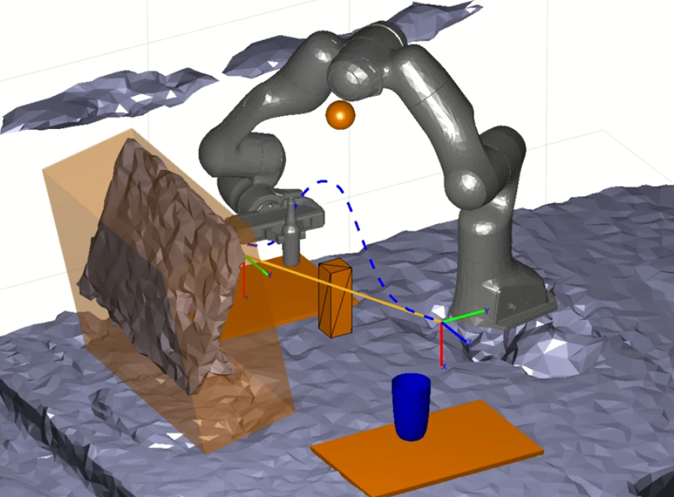

# Dependencies 
You will need the following MATLAB Toolboxes:
* MATLAB Robotics System Toolbox
* MATLAB Computer Vision Toolbox
* Robot Toolbox (made by Peter Corke) https://github.com/petercorke/robotics-toolbox-matlab

# Setup
Run configure.m to setup the MATLAB path variable. I have provided two barebone examples. The first describes how to segment a pointcloud to find obstacle primitives. The second shows how to plan a collision free trajectory to place a can on a coaster.

# Video demonstrations
* 
* 

